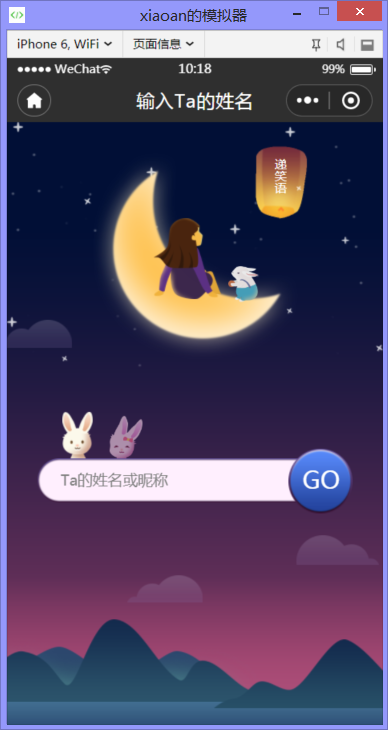
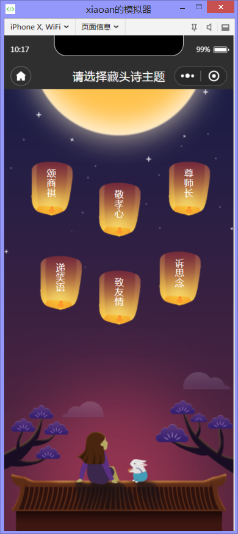
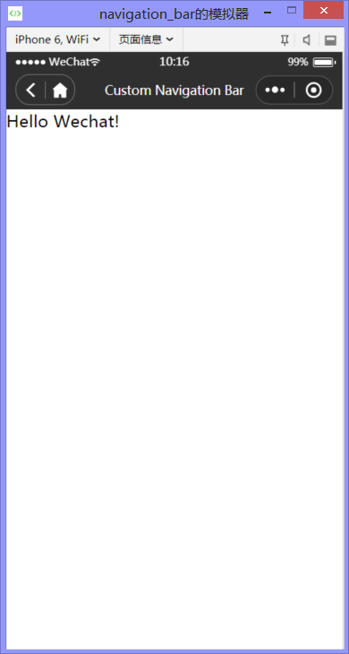
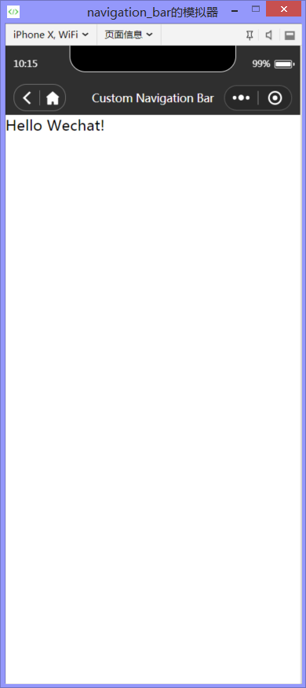

<h1 align="center" style="margin-bottom: 20px;">微信小程序自定义导航栏（wx_custom_navigation_bar）</h1>
<h2 align="center">可选择返回键、首页键，动态设置标题，响应式组件</h2>

<code>版本号：1.0.0</code>

作者：chen-yt

## 截图
</img>
</img>
</img>
</img>
